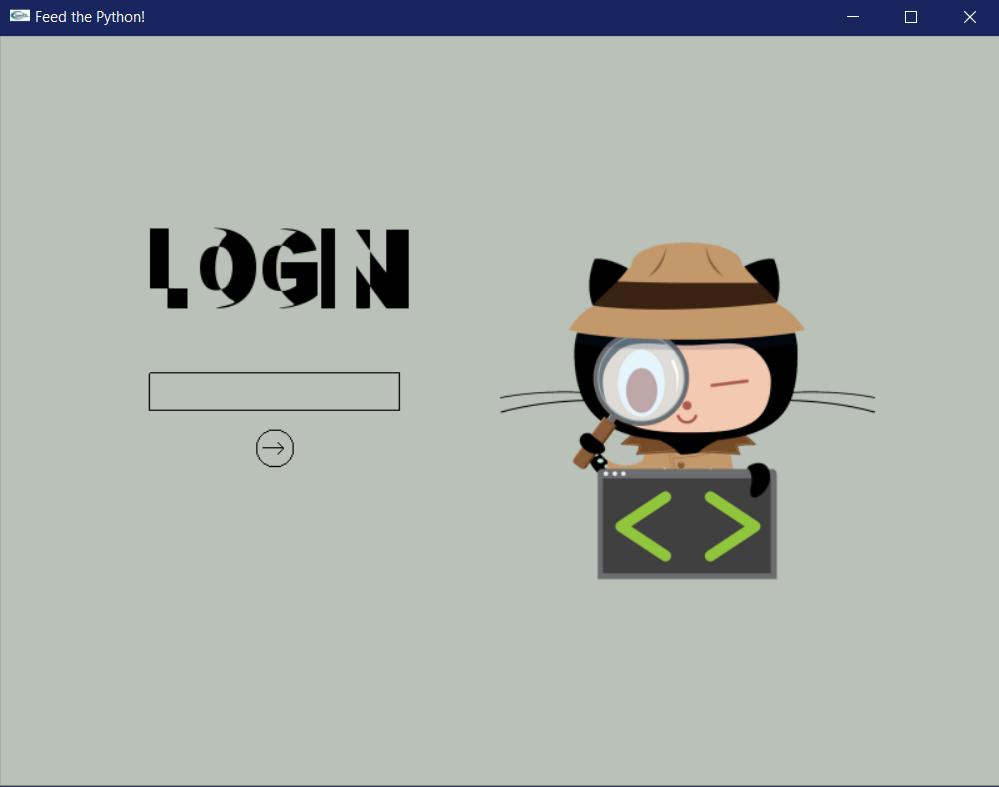
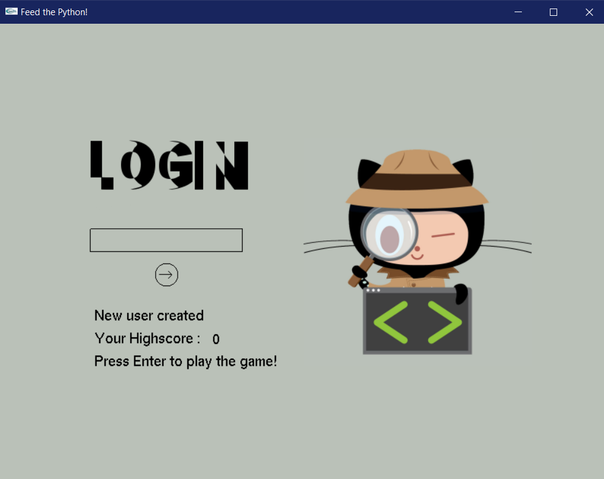
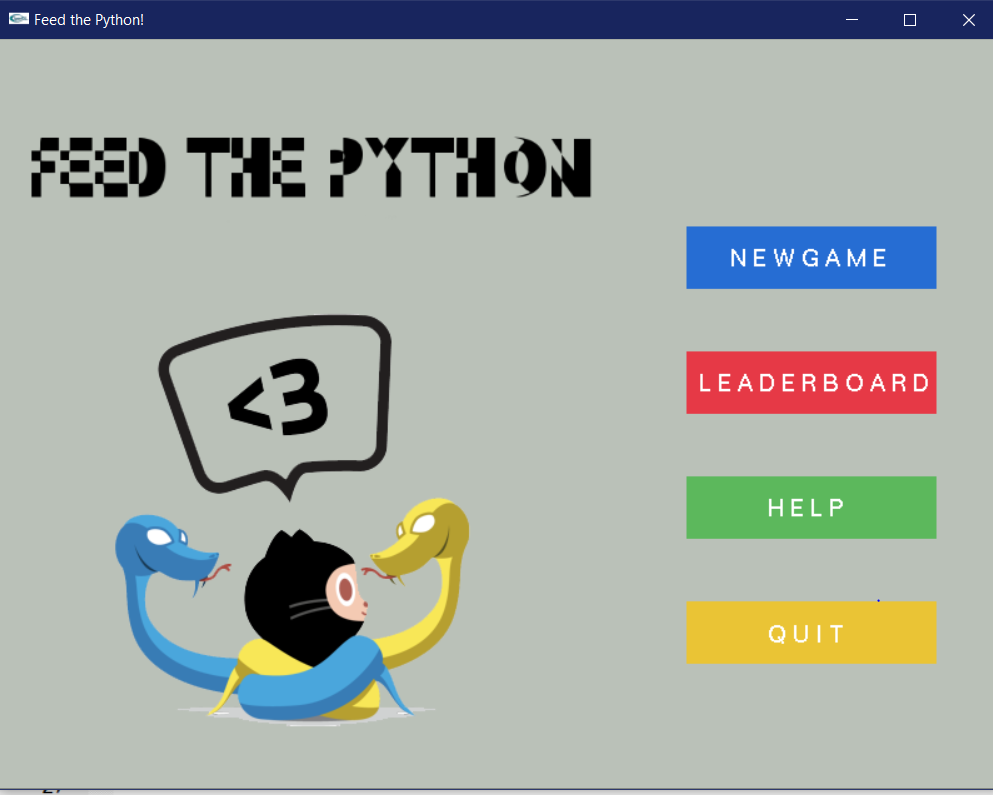
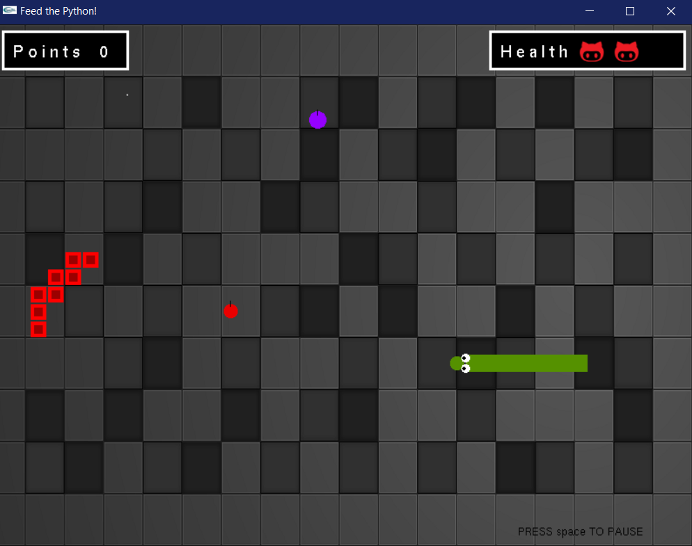
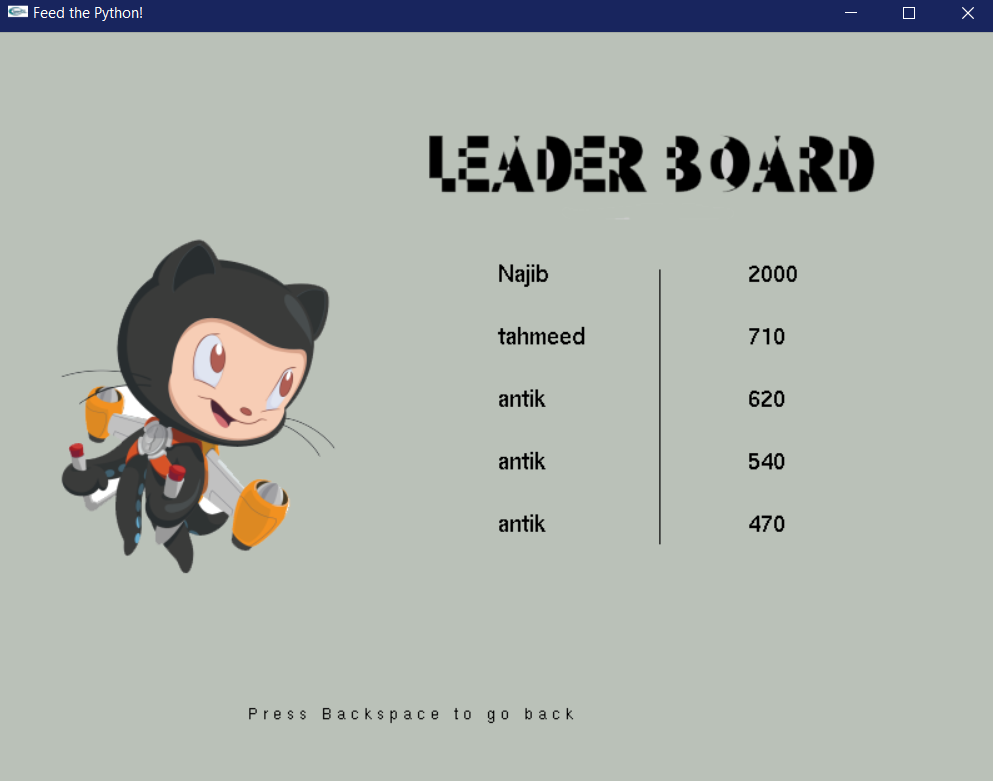
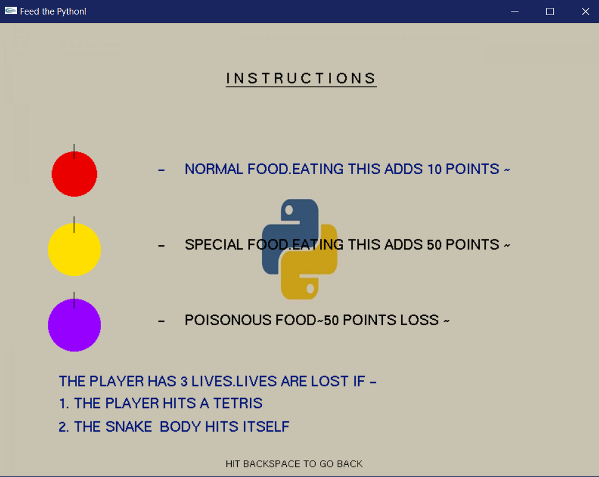
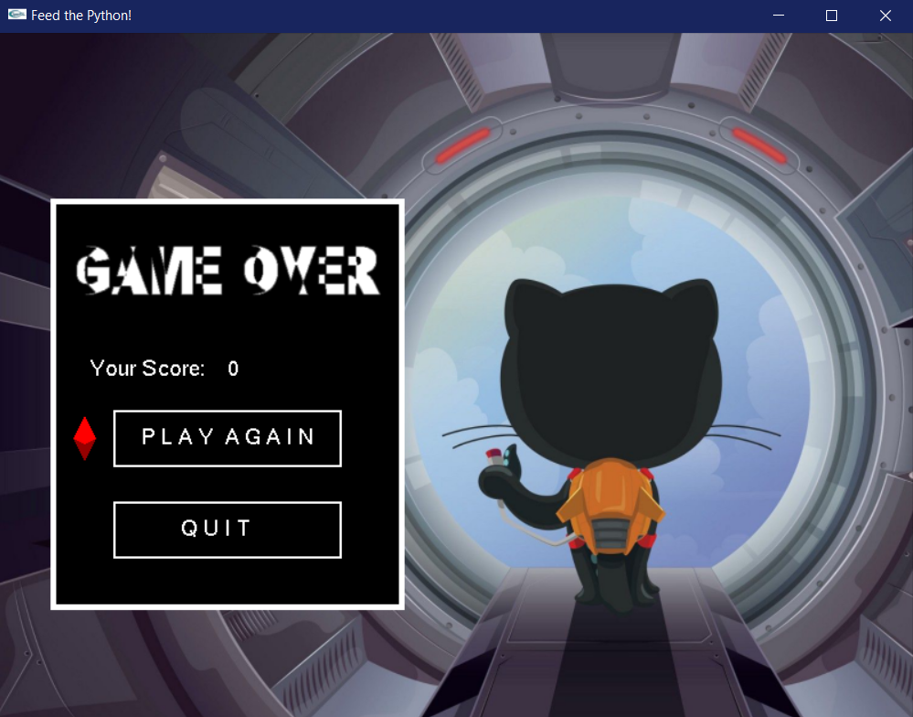
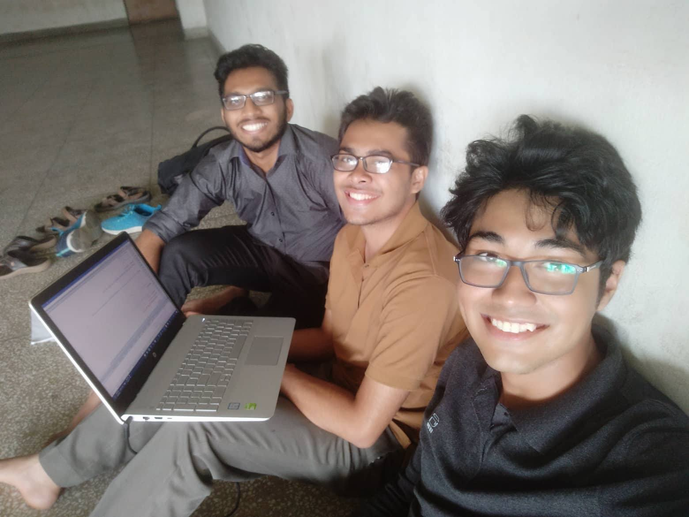

<h1>Feed the Python</h1> 

Term Project : CSE 102

Platform : Windows

Language and tools : C++, Igraphics

Project Developers : 
1. Najibul Haque Sarker (1705044)
2. Tahmeed Tarek (1705039)
3. Ayan Antik Khan (1705036)

<h1>Project Walkthrough</h1>

First login using a username. 

The system will welcome the player with various messages.

The system will redirect to its homepage which has various options.

Clicking NEWGAME will start the game

Clicking LEADERBOARD will show the leaderboard

Clicking HELP will open the Help page

Clicking QUIT will end the game.

The snake has 3 lives. Its game over if the player loses all 3.

Its possible to pause and resume the game.

The game takes inspiration from the classic snake and tetris games.

